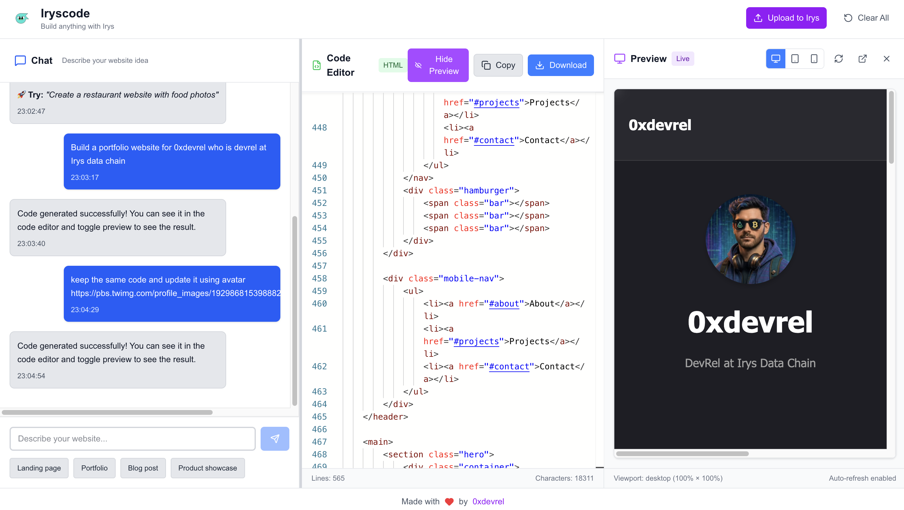

# 🚀 Iryscode - Static Site Generator

A **Lovable-like** application for generating beautiful static websites using AI. Simply describe what you want to build, and Iryscode will generate complete HTML, CSS, and JavaScript code using Google Gemini Flash 2.5.



## ✨ Features

- 🤖 **AI-Powered Generation** - Uses Google Gemini Flash 2.5 for intelligent code generation
- 💬 **Chat Interface** - Natural language prompts to describe your website
- 🎨 **Live Preview** - Real-time preview with responsive design testing
- 📝 **Code Editor** - Monaco editor with syntax highlighting and code editing
- 📱 **Responsive Design** - Preview in desktop, tablet, and mobile viewports
- 📥 **Export Functionality** - Download generated HTML files instantly
- 🔗 **Upload to Irys** - Upload generated websites to Irys testnet datachain
- 🎯 **Static Only** - Generates self-contained HTML with embedded CSS and JavaScript
- 🚫 **No Dependencies** - Creates vanilla web code without external libraries

## 🛠️ Tech Stack

- **Framework**: Next.js 15 with App Router
- **Language**: TypeScript
- **Styling**: Tailwind CSS v4
- **Code Editor**: Monaco Editor
- **AI**: Google Gemini Flash 2.5
- **Icons**: Lucide React
- **Build Tool**: Turbopack

## 🚀 Quick Start

### Prerequisites

- Node.js 18+ installed
- Google Gemini API key ([Get one here](https://makersuite.google.com/app/apikey))

### Installation

1. **Clone and install dependencies:**
   ```bash
   cd iryscode
   npm install
   ```

2. **Set up environment variables:**
   ```bash
   cp .env.local.example .env.local
   ```
   
   Add your Google Gemini API key to `.env.local`:
   ```
   GEMINI_API_KEY=your_gemini_api_key_here
   ```

3. **Start the development server:**
   ```bash
   npm run dev
   ```

4. **Open your browser:**
   Navigate to [http://localhost:3000](http://localhost:3000)

## 🎯 How to Use

### 1. **Start Chatting**
- Type your website idea in the chat sidebar
- Be specific about what you want (e.g., "Create a modern portfolio website with a hero section, about section, and contact form")

### 2. **Quick Start Prompts**
Click on pre-made prompts like:
- "Landing page"
- "Portfolio" 
- "Blog post"
- "Product showcase"

### 3. **Edit Code**
- Use the Monaco code editor to fine-tune the generated HTML
- Real-time preview updates as you type

### 4. **Test Responsiveness**
- Switch between desktop, tablet, and mobile views
- Use the refresh button to reload the preview

### 5. **Export Your Site**
- Click "Download" in the code editor
- Get a complete HTML file ready for hosting

### 6. **Upload to Irys Datachain**
- Click "Upload to Irys" in the header
- Your website will be uploaded to Irys testnet
- Get permanent, decentralized hosting with copyable URLs
- View your upload on the Irys explorer

## 💡 Example Prompts

Here are some example prompts to get you started:

- **"Create a modern landing page for a tech startup with a hero section, features, and pricing"**
- **"Build a personal portfolio website with a dark theme and smooth animations"**
- **"Design a restaurant menu page with elegant styling and interactive elements"**
- **"Create a blog post layout with a sidebar and comment section"**
- **"Build a product showcase page with image gallery and testimonials"**

## 🔧 Environment Variables

Create a `.env.local` file with:

```bash
# Required: Google Gemini API key (server-side only)
GEMINI_API_KEY=your_gemini_api_key_here

# Required for Upload to Irys feature: Ethereum testnet private key  
IRYS_PRIVATE_KEY=your_ethereum_private_key_here
```

**Setup Instructions:**
1. **Gemini API**: Get from [Google AI Studio](https://makersuite.google.com/app/apikey)
2. **Irys Upload**: Create testnet wallet → Get testnet ETH from [Irys Faucet](https://irys.xyz/faucet)

⚠️ **Security**: Never use mainnet private keys or keys with real funds

## 📁 Project Structure

```
iryscode/
├── src/
│   ├── app/
│   │   ├── layout.tsx          # Root layout
│   │   ├── page.tsx            # Main application page
│   │   └── globals.css         # Global styles
│   ├── components/
│   │   ├── Header.tsx          # App header
│   │   ├── ChatSidebar.tsx     # Chat interface
│   │   ├── CodeEditor.tsx      # Monaco code editor
│   │   └── PreviewPane.tsx     # Live preview iframe
│   └── lib/
│       └── gemini.ts           # Gemini API integration
├── public/                     # Static assets
├── .env.local                  # Environment variables
└── package.json               # Dependencies
```

## 🎨 What Can It Generate?

Iryscode can create any static website including:

- ✅ Landing pages with modern designs
- ✅ Portfolio websites with animations
- ✅ Business websites with contact forms
- ✅ Blog layouts and article pages
- ✅ Product showcase pages
- ✅ Event pages and invitations
- ✅ Restaurant menus and pricing tables
- ✅ Team member showcases
- ✅ FAQ sections and documentation
- ✅ Interactive components with JavaScript

### Limitations

- ❌ No server-side functionality
- ❌ No database connections
- ❌ No external API calls (except web APIs)
- ❌ No image generation
- ❌ No external dependencies/libraries

## 🛠️ Development

### Available Scripts

- `npm run dev` - Start development server with Turbopack
- `npm run build` - Build for production
- `npm run start` - Start production server
- `npm run lint` - Run ESLint

### Contributing

1. Fork the repository
2. Create your feature branch (`git checkout -b feature/amazing-feature`)
3. Commit your changes (`git commit -m 'Add amazing feature'`)
4. Push to the branch (`git push origin feature/amazing-feature`)
5. Open a Pull Request

## 📝 License

This project is licensed under the MIT License - see the [LICENSE](LICENSE) file for details.

## 🙏 Acknowledgments

- Inspired by [Lovable](https://lovable.dev) for the user experience
- Built with [Google Gemini](https://deepmind.google/technologies/gemini/) for AI code generation
- Uses [Monaco Editor](https://microsoft.github.io/monaco-editor/) for code editing

## 📞 Support

If you have any questions or issues:

1. Check the [Issues](https://github.com/yourusername/iryscode/issues) page
2. Create a new issue with a detailed description
3. Include error messages and steps to reproduce

---

**Happy coding! 🎉** Build amazing static websites with the power of AI.